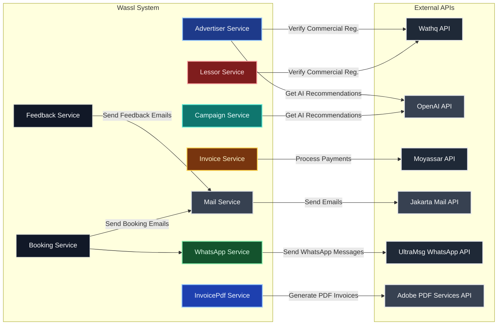

# Wassl 

## About the Project

**Wassl (وصل)** هو مشروع ذكي يربط **المعلنين** بـ **أصحاب اللوحات الإعلانية** بكل سهولة.

فكرته كذا: بدل ما يدوخ المعلن ويدور بنفسه، التطبيق يوصله مباشرة لصاحب اللوحة المناسبة ويخليه يطلق حملته بسرعة.

يعني تخيلها كأنها **تطبيق توصيل**:

- بس بدل ما نوصل وجبات  نوصل **إعلانات**.

- الذكاء الاصطناعي يعطي أفكار، استراتيجيات، ونصائح.

- الدفع يتم عن طريق Moyassar.

- التحقق من السجل التجاري يتم عبر Wathq.

- التواصل مع المعلن يتم عن طريق واتساب UltraMsg أو إيميل عبر Jakarta Mail.

**بالمختصر:**

> Wassl = **الإعلانات أوصل لك أسرع، أسهل، وأذكى** 

---

## Wassl Diagram (Simple Flow)

---

# My Endpoints

## Advertiser

* `POST /api/v1/advertiser/add` → **addAdvertiser** (wathq)

* `GET /api/v1/advertiser/competitor-analysis/{id}` → **competitorAnalysis** (openai)

* `GET /api/v1/advertiser/suggest-campaign-ideas/{id}` → **suggestCampaignIdeas** (openai)

* `GET /api/v1/advertiser/summarize-feedback/{id}` → **summarizeFeedback** (openai)

* `GET /api/v1/advertiser/monthly-strategy/{id}` → **monthlyStrategy** (openai)

* `GET /api/v1/advertiser/compliance-check/{id}` → **complianceCheck** (openai)

* `GET /api/v1/advertiser/advise-billboard-type/{advertiserId}` → **adviseBillboardType** (openai)

* `GET /api/v1/advertiser/audience-demographics-analysis/{advertiserId}` → **audienceDemographicsAnalysis** (openai)

## Campaign

* `GET /api/v1/campaign/advise/{id}` → **adviseCampaign** (openai)

* `GET /api/v1/campaign/predict-performance/{id}` → **predictPerformance** (openai)

## Billboard

* `DELETE /api/v1/billboard/delete/{lessor_id}/{billboard_id}` → **deleteBillboard**

* `GET /api/v1/billboard/lessor-rating/` → **findBillboardsByLessorRating**

## Invoice

* `POST /api/v1/invoice/pay/subscription/{advertiserId}` → **processPaymentSubscription** (moyassar)

*TOTAL 13 ENDPOINTS*

---
# Wassl Diagram

# External APIs Used

* **Wathq API (وثق)** → للتحقق من السجل التجاري إذا كان نشطًا أم لا.

* **Jakarta Mail API** → لإرسال البريد الإلكتروني من داخل النظام.

* **UltraMsg WhatsApp API** → للتواصل مع المعلنين عبر واتساب.

* **Moyassar API** → لمعالجة عمليات الدفع الإلكتروني (الاشتراكات).

* **OpenAI API** → لتوليد النصائح، التحليلات، الأفكار، والتوصيات الذكية.
  
* **Adobe PDF Services API** → لإنشاء فواتير واضحة للمستخدمين

## External Apis Diagram

